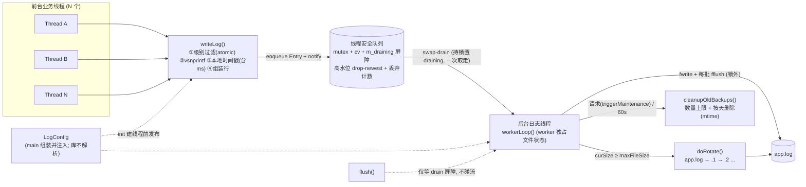
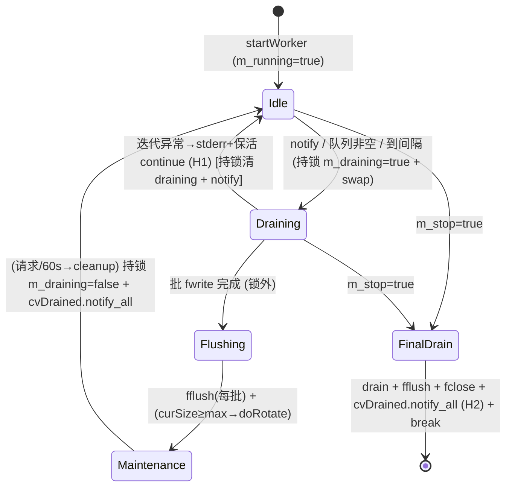

# 技术设计：跨平台异步日志系统（演进现有 `Log` 类）— v2

**Source**: 用户任务 + 独立 reviewer 对抗性审查（`source=task`）
**Date**: 2026-07-11（v2）
**Language**: C++（基线 C++11；轮转/保留用 C++17 `<filesystem>`，附无 C++17 退路）
**Type**: Backend / 系统库（无 UI，Frontend 步骤 N/A）
**Impact Scope**: 新增 0 文件 / 修改 3 文件（`clog.h`、`clog.cpp`、`log.cpp`）
**目标平台**: Linux（主力）+ Windows（MinGW-W64 GCC 16）

---

## v2 变更记录（相对 v1）

> reviewer 结论 v1"不能直接进实现"，本轮修掉全部会导致丢数据/UAF/死锁的设计级缺陷，并应用用户拍板决定。

**阻塞项修复（C=Critical / H=High）**

| ID | v1 缺陷 | v2 修法 |
|---|---|---|
| C1 | `flush()` 用 `m_queue.empty()` 当"已落盘"判据 → worker `swap` 后队列瞬空但未写盘，flush 提前返回丢数据 | 引入 **drain 屏障** `m_draining`：worker 持锁置位→swap→锁外写盘+fflush→持锁清位并 `notify_all`；`flush()` 谓词改 `(m_queue.empty() && !m_draining) \|\| m_stop` |
| C2+H3 | `m_fileStream`/`m_filePath` 无同步：flush 前台 `fflush` 与 worker `doRotate` 锁外 `fclose`+重开同流 → 轮转瞬间 **UAF**；`openFile` 运行期改名 race | 确立**文件状态 worker 独占**纪律（`init` 建线程前设置，之后仅 worker 访问）；`flush()` **不再触碰流**（只等屏障）；**禁止运行期 `openFile` 改名**（仅未初始化时委托 `init`）。§0.4 不变量真正成立 |
| H1 | `try/catch` 在 `for(;;)` **外**：单次迭代异常 → 线程死亡而 `m_stop` 仍 false → `flush()` 永久阻塞 | `try/catch` 移入**循环体内**（记录 stderr 后 `continue` 保活）；`flush()`/入队在 `!m_running` 时**快速失败降级 stderr**（启用原声明未用的 `m_running`） |
| H2 | 停止分支最终 drain 后直接 `break`，**无** `notify_all` → 关闭期迟到入队使 flush 死锁 | worker `break` 前**无条件** `m_cvDrained.notify_all()`；`flush()` 谓词加 `\|\| m_stop` |
| H4 | 自动启动与显式 `init` 共用 `m_startOnce` → 谁先跑谁定终身，静态对象先打日志会让 `main` 的 `init(cfg)` 变空操作，配置被静默丢弃 | auto-start 与显式 `init` **分离**（`m_initMutex` + `m_started`）；`init()` 检测到已 auto-start 时**停旧 worker → 应用新 cfg → 重启**（清晰重配语义） |
| H5 | "默认文件名=程序自身名"仅 `fromArgs` 成立，其它路径退成硬编码 `app.log`，§13 谎报 100% | 改**平台自省**：Linux `/proc/self/exe`、Windows `GetModuleFileNameA`；`defaultLogPath()` 不依赖 argv，全路径可用；§13 **如实**修正 |

**用户拍板决定**

1. **队列满** → 保持 **drop-newest + 计数、绝不阻塞**（维持 v1 设计）。
2. **配置文件** → 日志库**不再解析配置文件/命令行**；配置是 `main` 职责，解析后经 `LogConfig` 结构体传入。**删除** `LogConfig::fromFile()`、`fromArgs()`、`--log-*` 参数、key=value 解析器；`LogConfig` + `init(const LogConfig&)` 为唯一配置入口；原型手工构造 struct。
3. **时间戳** → **加毫秒** `YYYY-MM-DD HH:MM:SS.mmm`（`std::chrono` 取亚秒，日历部分仍走线程安全 `localtime_s`/`_r`）。
4. **单测框架** → 保持原型 + 断言（不引 doctest/GoogleTest）。

**中低项**

- **M1** `doRotate` 末位改名前先 `fsRemove(dst)`（覆盖 `maxBackupCount==1` 且退路 `std::rename` 在 Windows 目标已存在会失败）。
- **M4** 新增 `m_writeErrors` 成员；Step 6 落地磁盘满/短写**真实计数** + 超阈值禁用 sink。
- **M5** `init` 对 `flushIntervalMs`（下限 ≥1，防 `wait_for(0)` 忙轮询）、`maxFileSize` 做校验/clamp。
- **M2/M3** 单例改为**有意泄漏**（`static Log* p = new Log(); return *p;`，永不析构，OS 回收）+ `std::atexit` flush 钩子 → **根除静态析构顺序 UAF**（对象永远有效，晚到日志安全降级 stderr）。
- **L2** `cleanupOldBackups` 数量清理遇编号空洞**不提前 break**。
- **L3** 删除**公有** `Log(const char* fileName)` 构造（绕过单例的第二入口）。
- **L4** 退路门控钉死 `!defined(LOG_NO_FILESYSTEM) && defined(__cpp_lib_filesystem)`；`<filesystem>` 补进 include 清单。
- **L5** 原型**写** `last_write_time(now-40d)` 触发时间清理（设置 mtime 已在 probe 验证，见 F5）；新增小型公有 `triggerMaintenance()` 供确定性触发 + 生产期主动清理。

---

## 0. Pre-Work

### 0.1 Intent Check（半页纸）

| 项 | 内容 |
|---|---|
| **目标** | 把半成品同步 `Log` 演进为跨平台、异步、配置驱动、带轮转/保留的生产级日志库；业务线程 `writeLog` 只投递不写盘、绝不阻塞。 |
| **范围** | 仅本仓 3 文件：`clog.h`/`clog.cpp`（库）、`log.cpp`（验证原型 `main`）。不新增文件、不引第三方库、不引构建系统。 |
| **关键假设** | ①配置由 `main` 组装 `LogConfig` 传入，**日志库不解析任何配置/命令行**（用户决定 2）；②队列满 **drop-newest + 计数**（用户决定 1）；③按"天"用文件 mtime 清理；④单进程写单文件（不做多进程文件锁）；⑤仅文件 sink，内部错误/降级走 stderr。 |
| **对照先例** | 无同类先例，基底 = 现有 `Log` 自身（保留 `LogLevel`/`LevelMsg`/`vsnprintf`+`strftime` 思路/`fopen` 追加/单例骨架）。归入 §9.9 R9-1（全新异步模式）。 |
| **前置条件（新增·重要）** | `init()` 必须在**启动会打日志的业务线程之前**、由 `main` 调用一次；`m_cfg` 因此"启动后有效不可变"，热路径无需锁读配置（详见 §0.4）。 |

### 0.2 ROOT-FACTS（关键前提已实证）

```
ROOT-FACTS
F1: 现状 getInstance() 是假单例（每次 new Log()，非单例且泄漏） | 查实: Read clog.cpp:23-26 | 输出: `return new Log();` | 结论: 成立
F2: 现状用 gmtime（UTC + 非线程安全）打时间戳 | 查实: Read clog.cpp:52-54 | 输出: `strftime(...,gmtime(&now))` | 结论: 成立
F3: 现状硬编码 "\r\n"、无 flush、无 NULL 流检查、无级别过滤、~Log 无条件 fclose、有公有 Log(const char*) 第二入口 | 查实: Read clog.cpp:15-56 | 结论: 成立
F4: MinGW-W64 GCC 16.1.0，thread model=posix（std::thread/mutex/cv/atomic 可用） | 查实: `g++ -v` | 输出: `Target: x86_64-w64-mingw32 ... Thread model: posix`；`--enable-threads=posix --enable-__cxa_atexit --enable-libstdcxx-time` | 结论: 成立
F5: C++17 <filesystem>（file_size/rename/remove）+ 设置 last_write_time(now-40d) + "同时钟差值"时间判定 + localtime_s，全部编译并运行通过 | 查实: 编译运行 probe.cpp | 输出: `PROBE_OK thread=1 file_size=11 retention_trick=1 localtime=2026-07-11 21:52:06 __cplusplus=201703` | 结论: 成立（含"设置 mtime"可行，覆盖 L5）
F6: localtime_s 返回本地时间（非 UTC） | 查实: 同 F5 | 结论: 成立
F7: 现有 Log/writeLog/getInstance/LogLevel 无任何外部调用点（log.cpp 空 TU） | 查实: Grep 全仓 | 输出: 仅命中 clog.h/clog.cpp 自身 | 结论: 成立 → API 可自由演进
F8: 动态链接 exe 需 MinGW/bin 在 PATH，否则 exit 127；-static 产出独立 exe | 查实: 先动态运行(exit 127)再 -static 运行(PROBE_OK) | 结论: 成立 → 验证/交付用 -static
F9: 毫秒级本地时间戳（system_clock 取亚秒 + localtime_s + strftime + snprintf）编译运行通过 | 查实: 编译运行 probe2.cpp | 输出: `ts=2026-07-11 22:27:02.978` | 结论: 成立（用户决定 3）
F10: 平台自省取程序名（Windows GetModuleFileNameA）+ basename/去.exe，独立于 argv | 查实: 同 F9 | 输出: `exe=C:\...\clogv2probe.exe default=clogv2probe.log` | 结论: 成立（H5 修复全路径可用；Linux 用 /proc/self/exe，实现期在 Linux 复验）
```

### 0.3 Scope Challenge

- 改动文件数 **3**（<8）✅；新增 class **0**（演进 `Log` + 1 个轻量 `struct LogConfig`，<2）✅；单仓 ✅
- v2 相对 v1 未扩大文件范围；仅在 `clog.h`/`clog.cpp` 内新增少量成员/私有方法 + 1 个小公有方法 `triggerMaintenance()`（兼作生产期主动清理，非纯测试用）。
- 推荐 **方案 B（单后台线程 + 有界队列 + 轮转/保留，演进 3 文件）**，理由同 v1。

### 0.4 数据源一致性检查（v2 同步纪律 · 关键）

> **纪律**：可变**文件状态**（`m_fileStream`/`m_filePath`/`m_curSize`/`m_writeErrors`/`m_lastCleanup`）**worker 线程独占**——由 `init`/`applyConfig` 在 **worker 启动前**设置（靠线程创建的 happens-before 发布），此后**仅 worker** 访问。前台/`flush()` **绝不**解引用 `m_fileStream`。这让 v1 被推翻的"文件状态仅后台线程访问"不变量在 v2 真正成立（修 C2/H3）。

| 状态 | 写入点 | 读取点 | 同步方式 |
|---|---|---|---|
| `m_fileStream`/`m_filePath`/`m_curSize`/`m_writeErrors`/`m_lastCleanup` | `applyConfig`/`openStream`/`writeEntry`/`doRotate`（均在**无并发 worker** 时或 **worker 内**） | 仅 `workerLoop` 及其子调用 | **worker 独占**（无锁）；重配时先 `stopWorker` join 旧 worker 再改，保证无并发 |
| `m_queue` + `m_draining` | `writeLog`(push) / `workerLoop`(swap, 置/清 draining) | `workerLoop` / `flush()` 谓词 | `m_mutex` 全程保护 |
| `m_cfg` | `applyConfig`（`m_initMutex` 下、无 worker 存活时） | 仅 `workerLoop`（读 maxFileSize/backupCount/backupDays/flushIntervalMs） | 启动后有效不可变；worker 启动前发布 |
| `m_enabled`/`m_level`/`m_flushLevel`/`m_maxQueueSize`/`m_stop`/`m_running`/`m_started`/`m_initialized`/`m_dropped`/`m_maintenanceReq` | `applyConfig`/`writeLog`/生命周期方法 | `writeLog` 热路径 / `workerLoop` | `std::atomic` |
| `init`/`ensureAutoStarted`/`stopWorker`/`shutdown` 状态转换 | 上述方法 | — | `m_initMutex` 串行化 |

> `writeLog` 热路径**只读 atomics + 仅入队时短持 `m_mutex`**；`m_maxQueueSize` 单列为 atomic，使 `writeLog` **不依赖 `m_cfg`**（消除前台读 `m_cfg` 的潜在竞态）。`writeLog` 仅在"首个日志早于 `init`"的安全网路径才可能短暂取 `m_initMutex`（`m_started` 一旦为真即走无锁快路径，不再触碰）。

### 0.5 Repo Conventions Audit

| 新增/修改 | 维度 | 现有惯例 | 本设计选择 | 对齐/偏离 |
|---|---|---|---|---|
| `Log` | 命名空间 | 全局无 namespace | 保持全局 | ✅ 对齐 |
| `clog.h` | 头文件保护 | `#ifndef _LOG_H` | 保留 | ✅ 对齐 |
| `levelName()` | 级别表 | 头内 `static LevelMsg[]`（每 TU 副本、无越界保护） | 下沉 `clog.cpp` + 安全访问器 | ⚠️ 偏离，理由：更安全、去重（保留 `LevelMsg` 语义） |
| 文件写 | IO API | `fopen/fprintf/fclose`（`FILE*`） | 沿用 `FILE*`（`fopen "ab"` + `fwrite`） | ✅ 对齐 |
| 返回码 | 命名 | `EE_SUCSESS`(拼写错)/`EE_FAILURE` | 加 `EE_SUCCESS` + `#define EE_SUCSESS EE_SUCCESS` | ⚠️ 偏离（修拼写+兼容）→ R9-6 |
| `Log(const char*)` | 构造入口 | 现有公有第二构造 | **删除**（绕过单例） | ⚠️ 偏离，理由：与真单例冲突，无外部调用点(F7)，L3 |

### 0.6 边界场景清单（每条对应 §10 步骤）

| # | 场景 | 期望行为 | §10 步骤 |
|---|---|---|---|
| B1 | 文件打不开 | 不 `assert`；stderr 告警 + 禁用文件 sink，业务继续 | Step 4 `openStream()` |
| B2 | 写日志时 `m_fileStream==NULL` | 写前判 NULL，直接 return | Step 6 `writeEntry()` |
| B3 | 磁盘满 / 短写 | `m_writeErrors` **真实计数**，前 3 次 stderr 提示，超 100 次禁用 sink | Step 6 `writeEntry()` |
| B4 | 队列积压 | 高水位 `drop-newest` + `m_dropped` 计数，drain 时输出"dropped N"，前台不阻塞 | Step 5 `writeLog()` / Step 7 |
| B5 | 退出未 flush | `atexit(shutdown)` + 可选显式 `shutdown()`：drain+fflush+join；单例泄漏不析构 → 无析构竞态 | Step 8 `shutdown()` |
| B6 | 静态析构顺序：晚到日志 | 单例**永不析构**（有意泄漏），对象始终有效；`writeLog` 见 `m_stop`/`!m_running` 降级 stderr，**无 UAF** | Step 3/5 |
| B7 | 低于阈值级别 | 最热路径 atomic 判定后立即 return（`vsnprintf` 之前） | Step 5 |
| B8 | 未 `init` 直接打日志 | `ensureAutoStarted()` 用默认配置自动启动（安全网，与显式 init 分离机制，H4） | Step 4/5 |
| B9 | worker 单次迭代抛异常 | 循环体内 `try/catch` 记录后 `continue` **保活**；`m_running` 仍真，`flush()` 不假死 | Step 7 (H1) |
| B10 | 关闭期调用 `flush()` | `flush()` 谓词含 `\|\| m_stop` + worker `break` 前无条件 `notify_all` → 不死锁 | Step 7/8 (H2) |
| B11 | 已 auto-start 后 `main` 调 `init(cfg)` | `init` 停旧 worker → 应用 cfg → 重启（配置生效，不静默丢弃） | Step 4 (H4) |

### 0.7 Performance Audit（logging 域适配）

| 层 | 位置 | 结论 | 缓解 |
|---|---|---|---|
| Layer 1 DB | — | N/A — 无数据库 | — |
| Layer 2 算法/集合 | 队列 push/pop、swap-drain、组装行 | ✅ O(1)；批量 `std::swap` 一次；无 O(N²) | 组装行 `reserve()` |
| Layer 3 网络/RPC | — | N/A — 无 RPC | — |
| Layer 4 并发/锁 | `writeLog` 入队 / `workerLoop` | ✅ 锁内仅 push/swap/置 draining，IO 全在锁外（规避 4.1）；过滤 atomic relaxed 免锁；cv 一律带谓词（4.4） | swap-drain 缩短临界区；`notify_one` 解锁后调用 |
| Layer 5 缓存 | — | N/A — 无缓存 | — |
| Layer 6 序列化/IO | `writeEntry` fwrite + fflush | ⚠️ 每行 fflush 会致 syscall 风暴 | **每批** fflush + `flushLevel` 立即 + `flushIntervalMs`（**clamp ≥1ms**，M5）周期兜底 |
| Layer 8 日志守卫 | `writeLog` 级别过滤 | ✅ 低于阈值最先 return，且不进入格式化（等价 `isXxxEnabled`） | atomic relaxed 读 |

> 无 ⚠️ 未缓解项。

---

## 1. Requirements Summary

| # | Requirement | Priority | Complexity |
|---|---|---|---|
| R1 | 跨平台（Windows + Linux 同一套源码） | P0 | medium |
| R2 | 异步后台日志线程：自动启动 + `writeLog` 仅投递不阻塞 + 优雅关闭（flush+join） | P0 | high |
| R3 | 配置驱动（开关/级别/路径）；默认 `INFO` + 默认文件名=程序自身名；低于阈值丢弃；**配置由 main 经 `LogConfig` 传入，库不解析配置** | P0 | medium |
| R4 | 轮转/保留：大小滚动 + 备份数上限 + 按时间删除；后台线程执行 | P0 | high |
| R5 | 修复现状 bug（假单例+泄漏、NULL 流、无过滤、无 flush、UTC、`\r\n`、`~Log` NULL fclose、`openFile` 重复调用泄漏、公有第二构造） | P0 | low |
| R6 | 线程安全队列（mutex+cv）+ 容量上限 + 背压 + 丢弃策略 | P1 | medium |
| R7 | 错误处理与边界（打不开/磁盘满/积压/退出未 flush/静态析构顺序/worker 异常/关闭死锁） | P0 | medium |

---

## 2. Architecture Overview（生产者-消费者异步模型）

前台任意业务线程 `writeLog` → 级别过滤(atomic) → `vsnprintf` 格式化 + 毫秒本地时间戳 → 组装整行 → 投递线程安全队列后立即返回。唯一后台线程 `workerLoop` 以 **swap-drain + drain 屏障** 批量取走、锁外 `fwrite`、按批 `fflush`，并做大小轮转与数量/时间清理。文件状态由 worker 独占。



---

## 3. File Changes

### New Files
（无）

### Modified Files — `clog.h`（演进声明）

| Type/Function | Full Signature | Change | Reason |
|---|---|---|---|
| `enum LogLevel` | `enum LogLevel { TRACE, DEBUG, INFO, WARN, ERROR, FATAL };` | Keep | R3/R5 |
| `levelName` | `const char* levelName(LogLevel level);` | New | R5 取代头内 static 数组 |
| 宏 | `#define LOG_STRING_LENGTH 1024`；`#define EE_SUCCESS 1`；`#define EE_FAILURE 0`；`#define EE_SUCSESS EE_SUCCESS` | Modify | R5 |
| 退路门控 | `#if !defined(LOG_NO_FILESYSTEM) && defined(__cpp_lib_filesystem)` → `#define LOG_USE_FILESYSTEM 1` else `0`（L4） | New | R1/L4 |
| `struct LogConfig` | 见 §4（**无** `fromFile`/`fromArgs`；仅 `static std::string defaultLogPath();`） | New/Modify | R3/R4/用户决定2 |
| `Log::getInstance` | `static Log& getInstance();` | Modify | R5 真单例（有意泄漏，见 Step 3） |
| `Log::init` | `void init(const LogConfig& cfg);` | New | R2/R3/H4 |
| `Log::writeLog` | `void writeLog(LogLevel level, const char* fmt, ...);` | Modify | R2/R3 |
| `Log::flush` | `void flush();` | New | R2/C1 |
| `Log::shutdown` | `void shutdown();` | New | R2/H2/B5 |
| `Log::triggerMaintenance` | `void triggerMaintenance();` | New | R4/L5（按需触发清理） |
| `Log::openFile` | `int openFile(const char* fileName);` | Modify | R5 兼容；禁运行期改名(H3) |
| `Log::~Log` | `~Log();` | Modify | 防御性 `shutdown()`（正常不运行，单例泄漏） |
| 删除 | ~~`Log(const char* fileName);`（公有第二构造）~~ | **Remove** | L3 |
| 私有方法 | `Log();`、`Log(const Log&)=delete;`、`operator==delete;`、`void applyConfig(const LogConfig&);`、`void ensureAutoStarted();`、`void startWorker();`、`void stopWorkerLocked(bool terminal);`、`void workerLoop();`、`void writeEntry(const std::string&);`、`void rotateIfNeeded(std::size_t);`、`void doRotate();`、`void cleanupOldBackups();`、`void maybeCleanup();`、`bool openStream();`、`void registerExitHookOnce();` | New/Modify | R2/R4/R5/H1/H4 |
| 成员 | 见 §4 | Modify | 取代 `char m_fileName[]` |
| 便捷宏 | `LOG_TRACE/DEBUG/INFO/WARN/ERROR/FATAL(...)` → `Log::getInstance().writeLog(LVL, __VA_ARGS__)` | New | R3 |

### Modified Files — `clog.cpp`
所有函数体见 §10；跨平台 static helper：`formatLocalTime`（含 ms，F9）、`executablePath`（F10）、`fsSize/fsExists/fsRename/fsRemove/fsAgeExceedsDays`（`LOG_USE_FILESYSTEM` 分支）、`parseLevel`（可选，供原型）。

### Modified Files — `log.cpp`
由空 TU 改造为**验证原型 `main()`**：手工构造 `LogConfig`（无命令行解析）→ 多线程写入 + 级别过滤 + 小 `maxFileSize` 触发轮转 + `last_write_time(now-40d)` + `triggerMaintenance()` 触发时间清理 + 优雅关闭。见 §9。

### No Changes (verified)
无其它源文件/构建脚本（Glob 全仓）。

## 3.5 Reuse Inventory

| 复用项 | 位置 | 复用方式 |
|---|---|---|
| `enum LogLevel` + 级别顺序 | `clog.h:12-20` | 原样；过滤依赖数值顺序 |
| `LevelMsg[]` | `clog.h:11` | 下沉 `clog.cpp`，`levelName()` 安全包装 |
| `vsnprintf` + `va_list` | `clog.cpp:47-51` | 保留在 `writeLog` 前台段 |
| `strftime` + 格式串 `"%Y-%m-%d %H:%M:%S"` | `clog.cpp:6,52-54` | 保留，`gmtime`→线程安全本地时间 + 追加 `.mmm` |
| 行格式 `"时间 级别 \| 正文"` | `clog.cpp:55` | 保留，`\r\n`→`\n` |
| `fopen(...,"ab+")` | `clog.cpp:18,30` | 改 `"ab"`（二进制追加、只写） |
| `EE_SUCCESS/EE_FAILURE` | `clog.h:7-8` | 保留（修拼写+别名） |
| 单例 `getInstance()` 骨架 | `clog.cpp:23-26` | 骨架保留，实现改有意泄漏局部静态指针 |

---

## 4. Data Models

### `LogConfig`（头文件内；**无** fromFile/fromArgs）

```cpp
struct LogConfig {
    bool         enabled         = true;                 // R3 总开关
    LogLevel     level           = INFO;                 // R3 默认阈值
    std::string  filePath;                               // R3 空 → defaultLogPath()（平台自省, H5）
    std::size_t  maxFileSize     = 10 * 1024 * 1024;     // R4 单文件上限(字节)；0=不按大小轮转
    int          maxBackupCount  = 5;                    // R4 备份数上限；0=不留备份
    int          maxBackupDays   = 30;                   // R4 超过则删除；0=不按时间清理
    std::size_t  maxQueueSize    = 100000;               // R6 队列高水位；0=无上限
    LogLevel     flushLevel      = ERROR;                // R2 >= 此级别所在批立即 fflush
    unsigned     flushIntervalMs = 1000;                 // R2 周期唤醒/flush(ms)；init 内 clamp ≥1

    static std::string defaultLogPath();                 // 平台自省取自身名 + ".log"（H5，唯一 helper）
};
```

### `Log` 成员（取代 `char m_fileName[STRING_LENGTH]; FILE* m_fileStream;`）

```cpp
struct Entry { LogLevel level; std::string text; };

// 热路径 atomics（前台读）
std::atomic<bool>        m_enabled;
std::atomic<int>         m_level;
std::atomic<int>         m_flushLevel;
std::atomic<std::size_t> m_maxQueueSize;    // v2 新增：热路径读，writeLog 不依赖 m_cfg（消竞态）

// 生命周期 atomics
std::atomic<bool>        m_stop;            // 请求停止（shutdown 后为终态 true）
std::atomic<bool>        m_running;         // v2 启用：worker 存活（H1）
std::atomic<bool>        m_started;         // v2 新增：worker 至少启动过一次（H4）
std::atomic<bool>        m_initialized;
std::atomic<bool>        m_maintenanceReq;  // v2 新增：请求 worker 立即清理（L5）

LogConfig                m_cfg;             // 启动前发布；此后仅 worker 读

// 队列 + 同步
std::mutex               m_mutex;           // 保护 m_queue + m_draining
std::condition_variable  m_cvWork;
std::condition_variable  m_cvDrained;
std::queue<Entry>        m_queue;
bool                     m_draining;        // v2 新增：drain 屏障（C1），仅 m_mutex 下读写
std::atomic<std::size_t> m_dropped;

std::mutex               m_initMutex;       // v2 新增：串行化 init/auto-start/stop 转换（H4）
std::thread              m_worker;

// worker 独占文件状态（init 建线程前设置，此后仅 worker）
std::FILE*   m_fileStream;
std::string  m_filePath;                    // 取代 char m_fileName[]
std::size_t  m_curSize;
std::size_t  m_writeErrors;                 // v2 新增（M4）
std::chrono::steady_clock::time_point m_lastCleanup;
```
> v1 的 `std::once_flag m_startOnce;` **删除**（改 `m_initMutex + m_started`，支持 `call_once` 无法表达的"重配重启"，H4）。

### Sentinel Values

| Field | Sentinel | 含义 |
|---|---|---|
| `maxFileSize` | `0` | 不按大小轮转（>0 时 init clamp 到 ≥512） |
| `maxBackupCount` | `0` | 不留备份（轮转即截断） |
| `maxBackupDays` | `0` | 不按时间清理 |
| `maxQueueSize` | `0` | 队列无上限（不丢弃） |

## 4.5 DB Migration
N/A — 无数据库。

## 5. API / Interface Changes（公开 API · v2）

> 用户决定 2：日志库**不解析**配置文件/命令行；`main` 自行组装 `LogConfig`。

### main 侧（唯一配置入口）

```cpp
#include "clog.h"

int main(/* argc, argv 由 main 自行处理，日志库不需要 */) {
    LogConfig cfg;                          // main 决定各字段来源（硬编码/自家解析器/环境变量…）
    cfg.level          = INFO;              // 默认已是 INFO
    // cfg.filePath 留空 → 自动 = 可执行文件名 + ".log"（平台自省，无需 argv, H5）
    cfg.maxFileSize    = 10 * 1024 * 1024;
    cfg.maxBackupCount = 5;
    cfg.maxBackupDays  = 30;

    Log::getInstance().init(cfg);           // 起后台线程 + 打开文件；**须在启动业务线程前调用一次**

    LOG_INFO("service start");
    Log::getInstance().writeLog(WARN, "value=%d name=%s", 42, "abc");
    // ... 业务运行，任意线程并发 LOG_* / writeLog（非阻塞）...

    Log::getInstance().shutdown();          // 可选；atexit 已注册兜底
    return 0;
}
```

### 业务代码打日志

```cpp
LOG_TRACE("enter %s", __func__);            // < INFO，被丢弃
LOG_INFO("user %d logged in", uid);
LOG_ERROR("open failed: %s (errno=%d)", path, errno);   // >= flushLevel → 所在批立即落盘
```

### 关键方法语义

| 方法 | 语义 |
|---|---|
| `init(cfg)` | 幂等-权威；未启动→按 cfg 启动；已 auto-start→停旧 worker+按 cfg 重启（H4）。**前置**：业务线程打日志前调用 |
| `writeLog` | 过滤→格式化(含 ms)→入队；队列满 drop-newest；`m_stop`/`!m_running` 降级 stderr。**永不阻塞** |
| `flush()` | 阻塞至"队列空且非 draining"（drain 屏障，C1）；**不触碰文件流**（C2）；`m_stop` 时立即返回（H2） |
| `shutdown()` | 幂等终态：`m_stop=true`→notify→join→fflush+fclose；`atexit` 自动注册一次 |
| `triggerMaintenance()` | 置请求位+notify，worker 下次醒来立即 `cleanupOldBackups()`（生产期主动清理/原型确定性触发） |

## 6. State Machine — 后台线程状态图（v2）



## 6.5 UI 状态穷举表
N/A — 无 UI。

---

## 7. 跨平台适配层（逐条差异 + 封装）

| # | 差异点 | Windows(MinGW) | Linux | 封装 |
|---|---|---|---|---|
| P1 | **本地时间(含 ms)** 替换 gmtime | `localtime_s(&tm,&t)` | `localtime_r(&t,&tm)` | `formatLocalTime()`：`system_clock` 取毫秒 + `#ifdef` 分支 + `strftime` + `snprintf("%s.%03d")`。**F6/F9 已验证** |
| P2 | **换行符** 替换 `\r\n` | 文本模式会转 CRLF | LF | 统一 `fopen(...,"ab")`(二进制) + 写 `'\n'` → 两平台纯 LF |
| P3 | **basename / 路径分隔** | `\` 或 `/` | `/` | `find_last_of("/\\")`；轮转用 `std::filesystem::path` |
| P4 | **文件大小** | `fs::file_size` / 退路 `_stat64` | `fs::file_size` / 退路 `stat` | `fsSize()` |
| P5 | **mtime + 老化判定** | `fs::last_write_time` | 同 | `fsAgeExceedsDays()`：同时钟差值 `file_time_type::clock::now()-last_write_time>hours(24*days)`。**F5 已验证（含设置 mtime）** |
| P6 | **重命名/删除** | `fs::rename/remove`(退路 `MoveFileExA`/`DeleteFileA`) | 同(退路 `std::rename`/`std::remove`) | `fsRename/fsRemove/fsExists` |
| P7 | **线程** | posix 模型(F4) | pthread | `std::thread` + `-pthread` |
| P8 | **运行时依赖** | 需 MinGW/bin 在 PATH 或 `-static`(F8) | glibc 自带 | 验证/交付用 `-static` |
| P9 | **程序自省取自身名(H5)** | `GetModuleFileNameA(NULL,buf,n)`（`<windows.h>`） | `readlink("/proc/self/exe",...)`（`<unistd.h>`） | `executablePath()`；**F10 已验证(Win)**，Linux 实现期复验；其它平台退回 `"app.log"` |

### 无 C++17 `<filesystem>` 的退路（L4 门控钉死）

```cpp
#if !defined(LOG_NO_FILESYSTEM) && defined(__cpp_lib_filesystem)
  #define LOG_USE_FILESYSTEM 1
  #include <filesystem>
#else
  #define LOG_USE_FILESYSTEM 0
  // #include <sys/stat.h> (POSIX) / <windows.h> (Win)
#endif
//  fsSize:            fs::file_size          | POSIX stat.st_size / Win _stat64
//  fsRename:          fs::rename             | std::rename（Win 覆盖前先 fsRemove(dst)，见 doRotate M1）
//  fsRemove:          fs::remove             | std::remove
//  fsAgeExceedsDays:  同时钟差值             | time(NULL) - stat.st_mtime > days*86400
```

---

## 8. 错误处理与边界

| 场景 | 处理 | 修复的现状/缺陷 |
|---|---|---|
| 文件打不开 | `openStream` 失败 → stderr + `m_fileStream=NULL`，业务继续；**不 assert** | 现状 `assert` abort |
| 流为 NULL 写 | `writeEntry` 写前判 NULL return | 现状无检查 |
| 磁盘满/短写 | `m_writeErrors` 计数：前 3 次 stderr 提示，≥100 次 `fclose` 禁用 sink（**真实伪码，M4**） | 现状无返回值检查 |
| 队列积压 | drop-newest + `m_dropped` 计数 + drain 时 "dropped N"；前台永不阻塞 | 新增（R6） |
| 退出未 flush | `atexit(shutdown)` + 可选显式 `shutdown()`：drain+fflush+join | 现状 `~Log` 无 flush + 对 NULL fclose UB |
| 静态析构顺序 | 单例**有意泄漏永不析构** → 对象始终有效；晚到日志见 `m_stop`/`!m_running` 降级 stderr → **无 UAF**（M2/M3） | v1 Meyers 析构竞态 |
| worker 异常 | 循环体**内** try/catch → 记录后 `continue` 保活；`m_running` 不假死 | v1 try/catch 在循环外 → 线程死亡 flush 永久阻塞(H1) |
| 关闭期 flush 死锁 | worker `break` 前无条件 `cvDrained.notify_all`；`flush()` 谓词加 `\|\| m_stop` | v1 无 notify(H2) |
| 轮转瞬间 UAF | 文件状态 worker 独占；`flush` 不碰流 | v1 单侧持锁 fflush vs 锁外 fclose(C2/H3) |
| flush 丢数据 | drain 屏障 `m_draining`：谓词 `(空 && !draining)\|\|stop` | v1 `queue.empty()` 误判(C1) |
| worker 自我投递死循环 | worker 内部错误只写 stderr，不 enqueue | 新增 |

---

## 9. Windows 模拟验证（MinGW GCC 16）

### 9.0 已完成的可行性 probe（本设计依据 F4–F10）

```
# probe1（C++17 栈 + 设置 mtime + 时间判定 + localtime_s；-static 见 F8）
g++ -std=c++17 -O2 -pthread -static probe.cpp  -o probe.exe
→ PROBE_OK thread=1 file_size=11 retention_trick=1 localtime=2026-07-11 21:52:06 __cplusplus=201703
# probe2（毫秒时间戳 + 平台自省自身名）
g++ -std=c++17 -O2 -pthread -static probe2.cpp -o clogv2probe.exe
→ ts=2026-07-11 22:27:02.978 exe=C:\...\clogv2probe.exe default=clogv2probe.log
```
覆盖：std::thread/mutex/cv/atomic、`<filesystem>`（含**设置** last_write_time，L5）、同时钟差值、`localtime_s` 本地时间、**毫秒格式**、**GetModuleFileNameA 自省**。

### 9.1 编译原型（无命令行解析，配置在代码内构造）

```powershell
# 主用（C++17 + 静态链接，独立 exe）
g++ -std=c++17 -O2 -pthread -static clog.cpp log.cpp -o logdemo.exe

# 无 C++17 退路（stat/rename 封装）
g++ -std=c++11 -O2 -pthread -static -DLOG_NO_FILESYSTEM clog.cpp log.cpp -o logdemo.exe

# Linux 等价
#   g++ -std=c++17 -O2 -pthread clog.cpp log.cpp -o logdemo
```

### 9.2 原型 `log.cpp` 行为（配置写死在代码里）

```
// 伪码要点（无 argv 依赖）
LogConfig cfg;
cfg.level = INFO; cfg.filePath = "demo.log";
cfg.maxFileSize = 4096; cfg.maxBackupCount = 3; cfg.maxBackupDays = 30;

// [B8/H4 可选自证] 先不 init 打一条 → auto-start 到默认名；再 init(cfg) 重配到 demo.log
// LOG_INFO("before init");            // 触发 auto-start（默认自身名.log）
Log::getInstance().init(cfg);          // 重配/启动到 demo.log

// (1) 多线程写入 + 级别过滤：4 线程 × 2000 条，级别轮转含 TRACE/DEBUG（应被过滤）
// (2) 大小轮转：写满触发 → demo.log + demo.log.1/.2/.3，无 .4
Log::getInstance().flush();            // 等 drain 屏障（C1），确保全部落盘、轮转完成

// (3) 时间清理（L5，确定性）：worker 空闲，对备份设置老 mtime 后主动触发
std::filesystem::last_write_time("demo.log.3",
    std::filesystem::file_time_type::clock::now() - std::chrono::hours(24*40));  // now-40d
Log::getInstance().triggerMaintenance();
Log::getInstance().flush();            // 等 worker 执行 cleanupOldBackups → 删除 demo.log.3

std::printf("produced=%d written=%d dropped=%zu\n", produced, written, dropped_est);
Log::getInstance().shutdown();         // (4) 优雅关闭
```
> 说明：时间清理演示在写线程 join + flush **之后**、无并发写时进行，`demo.log.3` 是**关闭的备份**（非活动流），主线程设置其 mtime 与 worker `cleanupOldBackups` 读取由 `triggerMaintenance` 的 `m_mutex`/notify 建立 happens-before，无竞态。

### 9.3 运行与断言（PowerShell）

```powershell
.\logdemo.exe            # 无命令行参数，配置在程序内

Get-ChildItem demo.log*                                   # A 轮转文件集
Test-Path demo.log.4                                      # B 数量上限 → False
(Select-String -Path demo.log* -Pattern 'TRACE|DEBUG' | Measure-Object).Count   # C 过滤 → 0
Get-Content demo.log -TotalCount 3                        # D 行格式(含 .mmm)
([regex]::Matches((Get-Content -Raw demo.log), "`r")).Count                     # E 无 CRLF → 0
Test-Path demo.log.3                                      # F 时间清理后 → False
```

### 9.4 预期现象

| 断言 | 预期 |
|---|---|
| A 文件集 | `demo.log` + `.1/.2/.3` |
| B 数量上限 | `demo.log.4` 不存在 |
| C 过滤 | 匹配 = 0 |
| D 行格式 | `2026-07-11 22:27:02.978 INFO \| ...`，级别 ∈ {INFO,WARN,ERROR,FATAL} |
| E 换行 | `\r` 计数 = 0 |
| F 时间清理 | 老化的 `demo.log.3` 被删（`triggerMaintenance`+`flush` 后） |
| 退出 | exit 0；`written == produced - dropped` |

---

## 9.9 Risk Assessment

| # | Risk | Impact | Mitigation | §10 步骤 |
|---|---|---|---|---|
| R9-1 | 全新异步模式无先例，并发 bug（丢唤醒/竞态/死锁/UAF） | high | cv 带谓词；文件状态 worker 独占；drain 屏障(C1)；关闭 notify(H2)；worker 保活(H1)；§9 多线程压测 | Step 5,7,8 |
| R9-2 | 静态析构顺序 UAF | high | 单例**有意泄漏永不析构**(M2/M3)；晚到日志降级 stderr | Step 3,5 |
| R9-3 | 队列内存暴涨 | medium | `maxQueueSize` 高水位 + drop-newest + 计数 | Step 5 |
| R9-4 | 每行 fflush 拖慢 | medium | 每批 fflush + flushLevel + flushIntervalMs(clamp≥1) | Step 7 |
| R9-5 | 轮转竞态/丢日志 | medium | 轮转全程 worker 内串行（关流→改名→重开）；M1 覆盖前先删 | Step 9 |
| R9-6 | 兼容旧拼写 `EE_SUCSESS` | low | `#define EE_SUCSESS EE_SUCCESS` | §3 |
| R9-7 | 无 C++17 环境 | low | `LOG_USE_FILESYSTEM` 门控 + stat/rename 退路(L4) | §7 |
| R9-8 | `init` 前置条件被违反（业务线程先于 init 打日志且多线程） | medium | 文档明确前置；auto-start 安全网 + `m_initMutex` 串行；`m_started` 真后热路径无锁 | §0.4, Step 4,5 |
| R9-9 | 单例有意泄漏被误判为内存泄漏（工具告警） | low | 文档注明"进程生命周期单实例、OS 回收"；如需可加 `LSAN` 抑制注释 | Step 3 |

---

## 10. Implementation Order

1. [ ] **头文件演进** — `clog.h`
   - Complexity: low　Reuse: `LogLevel`/`EE_*`
   - include：`<string> <queue> <mutex> <condition_variable> <atomic> <thread> <chrono> <cstdio> <cstdarg> <cstddef> <cstring>`；条件 `<filesystem>`（`LOG_USE_FILESYSTEM`，L4）；`clog.cpp` 内再按平台加 `<windows.h>`/`<unistd.h>`/`<sys/stat.h>`
   - 保留 `enum LogLevel`/`_LOG_H`；`STRING_LENGTH`→`LOG_STRING_LENGTH`；`EE_SUCCESS`+别名；声明 `levelName`、`LogConfig`(§4)、演进 `Log`(§3)、便捷宏；**删除公有 `Log(const char*)`(L3)**

2. [ ] **级别表 + 平台 helper** — `clog.cpp`
   - Complexity: medium
   - `LevelMsg[]` 下沉；`levelName(l)`：`int i=(int)l; return (i>=0&&i<6)?LevelMsg[i]:"?";`
   - `formatLocalTime`（**含 ms，F9**）：
     ```
     using namespace std::chrono;
     auto now=system_clock::now(); time_t t=system_clock::to_time_t(now);
     int ms=(int)(duration_cast<milliseconds>(now.time_since_epoch()).count()%1000);
     tm tmv{};  #if _WIN32 localtime_s(&tmv,&t); #else localtime_r(&t,&tmv); #endif
     char base[20]; strftime(base,sizeof base,"%Y-%m-%d %H:%M:%S",&tmv);
     snprintf(buf,n,"%s.%03d",base,ms);
     ```
   - `executablePath`（**F10**）：`#if _WIN32 GetModuleFileNameA(NULL,b,n) #elif __linux__ readlink("/proc/self/exe",...) #else ""`
   - `fsSize/fsExists/fsRename/fsRemove/fsAgeExceedsDays`（`LOG_USE_FILESYSTEM` 分支，§7）

3. [ ] **有意泄漏单例 + 构造/析构** — `clog.cpp`　Risk: R9-2,R9-9
   ```
   Log& Log::getInstance() {
       static Log* instance = new Log();   // 有意泄漏：进程生命周期单实例，永不析构 → 无静态析构顺序 UAF (M2/M3)
       return *instance;
   }
   Log::Log()
     : m_enabled(true), m_level(INFO), m_flushLevel(ERROR), m_maxQueueSize(100000),
       m_stop(false), m_running(false), m_started(false), m_initialized(false), m_maintenanceReq(false),
       m_draining(false), m_dropped(0),
       m_fileStream(nullptr), m_curSize(0), m_writeErrors(0),
       m_lastCleanup(std::chrono::steady_clock::now()) {}
   Log::~Log() { shutdown(); }   // 防御性；正常不运行（单例泄漏）
   ```

4. [ ] **init / applyConfig / ensureAutoStarted / startWorker / stopWorkerLocked / openStream / registerExitHookOnce** — `clog.cpp`　Risk: R9-8　[B1][B8][B11]
   ```
   void Log::init(const LogConfig& cfg) {                 // H4：权威、支持重配
       std::lock_guard<std::mutex> lk(m_initMutex);
       if (m_started.load()) stopWorkerLocked(/*terminal=*/false);   // 已 auto-start → 停旧
       applyConfig(cfg);
       if (m_cfg.enabled) { openStream(); startWorker(); }
       m_initialized.store(true, std::memory_order_release);
       registerExitHookOnce();
   }
   void Log::ensureAutoStarted() {                        // 安全网（与 init 分离机制, H4）
       if (m_started.load(std::memory_order_acquire)) return;   // 快路径无锁
       std::lock_guard<std::mutex> lk(m_initMutex);
       if (m_started.load()) return;
       applyConfig(LogConfig{});
       if (m_cfg.enabled) { openStream(); startWorker(); }
       m_initialized.store(true, std::memory_order_release);
       registerExitHookOnce();
   }
   void Log::applyConfig(const LogConfig& cfg) {          // 仅在无 worker 存活时调用
       m_cfg = cfg;
       if (m_cfg.filePath.empty()) m_cfg.filePath = LogConfig::defaultLogPath();   // H5 全路径可用
       if (m_cfg.flushIntervalMs < 1) m_cfg.flushIntervalMs = 1;                   // M5 防忙轮询
       if (m_cfg.maxFileSize != 0 && m_cfg.maxFileSize < 512) m_cfg.maxFileSize = 512;  // M5
       if (m_cfg.maxBackupCount < 0) m_cfg.maxBackupCount = 0;
       if (m_cfg.maxBackupDays  < 0) m_cfg.maxBackupDays  = 0;
       m_filePath = m_cfg.filePath; m_writeErrors = 0;
       m_enabled.store(m_cfg.enabled); m_level.store(m_cfg.level);
       m_flushLevel.store(m_cfg.flushLevel); m_maxQueueSize.store(m_cfg.maxQueueSize);
   }
   void Log::startWorker() {
       m_stop.store(false); m_running.store(true);        // 先置 true，消除 init 返回到 worker 调度空窗 (H1)
       try { m_worker = std::thread(&Log::workerLoop, this); m_started.store(true); }
       catch (...) { m_running.store(false); std::fprintf(stderr,"[logger] cannot start worker\n"); }
   }
   void Log::stopWorkerLocked(bool terminal) {            // 调用方须持 m_initMutex
       if (!m_started.load()) { if (terminal) m_stop.store(true); return; }
       m_stop.store(true); m_cvWork.notify_all();
       if (m_worker.joinable()) m_worker.join();
       if (m_fileStream) { std::fflush(m_fileStream); std::fclose(m_fileStream); m_fileStream=nullptr; }
       m_running.store(false); m_started.store(false);
       if (!terminal) m_stop.store(false);                // 重配路径复位以便重启；终态保持 true
   }
   bool Log::openStream() {                               // [B1]
       if (m_fileStream) { std::fclose(m_fileStream); m_fileStream=nullptr; }  // 修 openFile 重开泄漏
       m_fileStream = std::fopen(m_filePath.c_str(), "ab");                    // 二进制追加 → LF
       if (!m_fileStream) { std::fprintf(stderr,"[logger] open %s failed, file sink disabled\n",m_filePath.c_str()); return false; }
       m_curSize = fsSize(m_filePath); m_writeErrors = 0; return true;
   }
   void Log::registerExitHookOnce() {
       static std::once_flag once;                        // 仅注册幂等（不涉配置锁定，与 H4 无关）
       std::call_once(once, []{ std::atexit([]{ Log::getInstance().shutdown(); }); });
   }
   ```

5. [ ] **writeLog（前台生产者）** — `clog.cpp`　Risk: R9-2,R9-3　[B4][B6][B7][B8]
   ```
   void Log::writeLog(LogLevel level, const char* fmt, ...) {
       if (!m_enabled.load(std::memory_order_relaxed)) return;                 // [B7]
       if ((int)level < m_level.load(std::memory_order_relaxed)) return;       // [B7]
       char body[LOG_STRING_LENGTH];
       va_list ap; va_start(ap, fmt); std::vsnprintf(body, sizeof(body), fmt, ap); va_end(ap);  // 复用现状
       char ts[32]; formatLocalTime(ts, sizeof(ts));                            // 本地时间含 ms
       if (!m_started.load(std::memory_order_acquire) && !m_stop.load(std::memory_order_relaxed))
           ensureAutoStarted();                                                 // [B8] 仅首个日志早于 init 时
       if (m_stop.load(std::memory_order_relaxed) || !m_running.load(std::memory_order_acquire)) {
           std::fprintf(stderr, "%s %s | %s\n", ts, levelName(level), body);    // [B6][H1] 降级，单例泄漏永有效
           return;
       }
       std::string line; line.reserve(std::strlen(ts)+std::strlen(body)+16);
       line += ts; line += ' '; line += levelName(level); line += " | "; line += body; line += '\n';  // \r\n→\n
       {
           std::lock_guard<std::mutex> lk(m_mutex);
           std::size_t cap = m_maxQueueSize.load(std::memory_order_relaxed);
           if (cap && m_queue.size() >= cap) { m_dropped.fetch_add(1, std::memory_order_relaxed); return; }  // [B4]
           m_queue.push(Entry{ level, std::move(line) });
       }
       m_cvWork.notify_one();                                                    // 解锁后通知
   }
   ```

6. [ ] **writeEntry（落盘）** — `clog.cpp`　[B2][B3]
   ```
   void Log::writeEntry(const std::string& line) {        // worker-only
       if (!m_fileStream) return;                          // [B2]
       std::size_t n = std::fwrite(line.data(), 1, line.size(), m_fileStream);
       if (n < line.size()) {                              // [B3][M4]
           ++m_writeErrors; m_curSize += n;
           if (m_writeErrors <= 3) std::fprintf(stderr,"[logger] short write on %s (%zu/%zu), disk full?\n",m_filePath.c_str(),n,line.size());
           if (m_writeErrors >= 100) { std::fprintf(stderr,"[logger] too many write errors, disabling file sink\n"); std::fclose(m_fileStream); m_fileStream=nullptr; }
           return;
       }
       m_writeErrors = 0; m_curSize += n;
       rotateIfNeeded(0);
   }
   ```

7. [ ] **workerLoop（后台消费者）** — `clog.cpp`　Risk: R9-1,R9-4　[B9][B10]
   ```
   void Log::workerLoop() {                                // m_running 已在 startWorker 置 true
       for (;;) {
           std::queue<Entry> batch; bool stopping = false;
           try {
               { std::unique_lock<std::mutex> lk(m_mutex);
                 m_cvWork.wait_for(lk, std::chrono::milliseconds(m_cfg.flushIntervalMs),
                                   [this]{ return !m_queue.empty() || m_stop.load(); });   // [R9-1] 带谓词
                 m_draining = true;                          // [C1] 持锁置屏障再 swap
                 std::swap(batch, m_queue); stopping = m_stop.load(); }
               while (!batch.empty()) { writeEntry(batch.front().text); batch.pop(); }      // 锁外写(worker 独占)
               std::size_t d = m_dropped.exchange(0);
               if (d) { char ts[32]; formatLocalTime(ts,sizeof ts);
                        writeEntry(std::string(ts)+" WARN | [logger] dropped "+std::to_string(d)+" messages\n"); }
               if (m_fileStream) std::fflush(m_fileStream);  // [R9-4] 每批 flush
               if (m_maintenanceReq.exchange(false)) cleanupOldBackups();   // [L5] 按需清理
               maybeCleanup();                               // 60s 节流兜底
               { std::lock_guard<std::mutex> lk(m_mutex); m_draining=false; m_cvDrained.notify_all(); }  // [C1]
           } catch (...) {                                   // [H1/B9] 迭代异常保活
               std::fprintf(stderr,"[logger] worker iteration error, continuing\n");
               { std::lock_guard<std::mutex> lk(m_mutex); m_draining=false; m_cvDrained.notify_all(); }
           }
           if (stopping) {                                   // 最终彻底 drain
               std::queue<Entry> tail;
               { std::lock_guard<std::mutex> lk(m_mutex); std::swap(tail, m_queue); }
               try { while (!tail.empty()) { writeEntry(tail.front().text); tail.pop(); }
                     if (m_fileStream) std::fflush(m_fileStream); } catch (...) {}
               { std::lock_guard<std::mutex> lk(m_mutex); m_draining=false; m_cvDrained.notify_all(); }  // [H2/B10] break 前无条件 notify
               break;
           }
       }
       m_running.store(false);
   }
   ```

8. [ ] **flush / shutdown / triggerMaintenance** — `clog.cpp`　Risk: R9-1　[B5][B10]
   ```
   void Log::flush() {
       if (!m_running.load()) return;                        // [H1] worker 不在，无可等
       std::unique_lock<std::mutex> lk(m_mutex);
       m_cvWork.notify_one();                                // 唤醒可能空闲的 worker
       m_cvDrained.wait(lk, [this]{ return (m_queue.empty() && !m_draining) || m_stop.load(); });  // [C1][H2] 不碰流(C2)
   }
   void Log::shutdown() {                                    // 幂等终态
       std::lock_guard<std::mutex> lk(m_initMutex);
       stopWorkerLocked(/*terminal=*/true);                  // m_stop 保持 true → writeLog 降级 stderr
   }
   void Log::triggerMaintenance() { m_maintenanceReq.store(true); m_cvWork.notify_one(); }
   ```

9. [ ] **轮转 + 清理** — `clog.cpp`　Risk: R9-5　[R4]
   ```
   void Log::rotateIfNeeded(std::size_t) {
       if (m_cfg.maxFileSize == 0) return;
       if (m_curSize < m_cfg.maxFileSize) return;
       doRotate();
   }
   void Log::doRotate() {                                    // worker-only 串行 (R9-5)
       if (m_fileStream) { std::fclose(m_fileStream); m_fileStream=nullptr; }
       if (m_cfg.maxBackupCount <= 0) { fsRemove(m_filePath); openStream(); return; }
       for (int k = m_cfg.maxBackupCount - 1; k >= 1; --k) {
           std::string src = m_filePath + "." + std::to_string(k);
           std::string dst = m_filePath + "." + std::to_string(k+1);
           if (fsExists(src)) { fsRemove(dst); fsRename(src, dst); }
       }
       if (fsExists(m_filePath)) { std::string d1 = m_filePath + ".1"; fsRemove(d1); fsRename(m_filePath, d1); }  // [M1] 覆盖前先删
       openStream();                                         // 新 app.log, m_curSize=0
       cleanupOldBackups();
   }
   void Log::cleanupOldBackups() {                           // worker-only
       for (int k = m_cfg.maxBackupCount + 1; k <= m_cfg.maxBackupCount + 64; ++k) {   // [L2] 遇空洞不 break
           std::string p = m_filePath + "." + std::to_string(k);
           if (fsExists(p)) fsRemove(p);
       }
       if (m_cfg.maxBackupDays > 0)
           for (int k = 1; k <= m_cfg.maxBackupCount; ++k) {
               std::string p = m_filePath + "." + std::to_string(k);
               if (fsExists(p) && fsAgeExceedsDays(p, m_cfg.maxBackupDays)) fsRemove(p);   // 同时钟差值(F5)
           }
   }
   void Log::maybeCleanup() {                                // 60s 节流
       auto now = std::chrono::steady_clock::now();
       if (now - m_lastCleanup < std::chrono::seconds(60)) return;
       m_lastCleanup = now; cleanupOldBackups();
   }
   ```

10. [ ] **openFile 兼容 + defaultLogPath** — `clog.cpp`　[H3][H5]
    ```
    int Log::openFile(const char* fileName) {                // 兼容旧签名；禁运行期改名 (H3)
        if (m_started.load()) { std::fprintf(stderr,"[logger] openFile ignored: already running; use init()\n"); return EE_FAILURE; }
        LogConfig c; c.filePath = fileName ? fileName : "";
        init(c);
        return m_running.load() ? EE_SUCCESS : EE_FAILURE;
    }
    std::string LogConfig::defaultLogPath() {                // H5 全路径可用（F10）
        std::string p = executablePath();
        if (p.empty()) return "app.log";
        size_t sl = p.find_last_of("/\\"); if (sl!=std::string::npos) p = p.substr(sl+1);
        size_t dot = p.find_last_of('.');  if (dot!=std::string::npos) p = p.substr(0,dot);
        return p.empty() ? "app.log" : p + ".log";
    }
    ```

11. [ ] **验证原型** — `log.cpp`（改造空 TU）
    - Complexity: medium　见 §9.2（手工构造 LogConfig，无命令行；含 auto-start/H4 自证、last_write_time + triggerMaintenance 时间清理）

---

## 11. Test Plan

| Test | Command | Expected |
|---|---|---|
| 编译(Win/C++17) | `g++ -std=c++17 -O2 -pthread -static clog.cpp log.cpp -o logdemo.exe` | exit 0 |
| 编译(无 C++17 退路) | `g++ -std=c++11 -O2 -pthread -static -DLOG_NO_FILESYSTEM clog.cpp log.cpp -o logdemo.exe` | exit 0 |
| 运行原型 | `.\logdemo.exe`（无参数，配置在代码内） | exit 0，见 §9.4 |

## 11.5 Acceptance Criteria（BLOCKING · 不依赖命令行）

| AC ID | Req | Given | When | Then（机器可判） | Verification | Command |
|---|---|---|---|---|---|---|
| AC-R1-1 | R1 | MinGW GCC16(Win) | 编译 clog.cpp+log.cpp | exit==0，产出 `logdemo.exe` | manual(build) | `g++ -std=c++17 -O2 -pthread -static clog.cpp log.cpp -o logdemo.exe; echo $LASTEXITCODE` |
| AC-R2-1 | R2 | 原型多线程 | `shutdown()` 后 | 打印 `written == produced - dropped` 且 exit 0 | manual(run) | `.\logdemo.exe` |
| AC-R2-2 | R2/H4 | 原型 init 前先 `LOG_INFO` | init(cfg) 重配后 | 默认名 `<exe>.log` 与 `demo.log` 均存在（auto-start + 重配生效） | script | `.\logdemo.exe; Test-Path logdemo.log; Test-Path demo.log` |
| AC-R3-1 | R3 | 阈值 INFO | 写含 TRACE/DEBUG | `Select-String demo.log* 'TRACE\|DEBUG'` 命中 == 0 | script | §9.3-C |
| AC-R3-2 | R3/H5 | `filePath` 留空 | 运行 | 生成 `<可执行名>.log`（`Test-Path` True，全路径推导，非 argv） | script | §9.3 / F10 |
| AC-R4-1 | R4 | `maxFileSize=4096` | 写满 | `Test-Path demo.log.1` == True | script | §9.3-A |
| AC-R4-2 | R4 | `maxBackupCount=3` | 持续轮转 | `Test-Path demo.log.4` == False | script | §9.3-B |
| AC-R4-3 | R4 | `demo.log.3` mtime=now-40d + `triggerMaintenance()` | flush 后 | `Test-Path demo.log.3` == False | script | §9.2/§9.3-F |
| AC-R5-1 | R5 | 任意运行 | 读文件 | 无 CRLF（`\r` 计数==0）；行首为本地时间**含 `.mmm`** | script | §9.3-D/E |
| AC-R6-1 | R6 | `maxQueueSize` 极小 + 高频写 | drain 后 | 出现 `dropped N` 且 `written+dropped==produced`（不阻塞不丢账） | manual(run) | 原型小队列分支 |
| AC-R7-1 | R7/H1/H2 | 原型注入一次 worker 异常 + 关闭期调 flush | 触发 | 进程不 hang（有超时守护），`flush()` 返回，exit 0 | manual(run) | 原型异常注入分支（可选，实现期加） |

> `manual` = 4/11 ≈ 36%（AC-R7-1 视实现期是否加异常注入而定；不加则 3/10=30%）。均为"编译+运行原型+PowerShell 断言"可执行，无需测试框架（用户决定 4）。

## 12. Lint & Format
无既有配置。建议 `-Wall -Wextra -pedantic` 编译期检查。当前：None available, skip。

## 13. PRD Traceability Matrix（如实修正）

| 需求条目 | §1 | §10 Step | 状态 |
|---|---|---|---|
| 跨平台 Win+Linux | R1 | Step 2,7,§7 | Covered |
| 独立后台线程 + 异步投递 | R2 | Step 5,7 | Covered |
| 自动启动 | R2 | Step 4(`init`/`ensureAutoStarted`) | Covered |
| 优雅关闭(flush+join) | R2 | Step 8 | Covered |
| 配置驱动(开关/级别/路径) | R3 | Step 4,§4 | Covered |
| 默认 INFO | R3 | §4 默认值 | Covered |
| 默认文件名=自身名 | R3 | Step 10 `defaultLogPath`(平台自省, **全路径**) | Covered（H5 修复；不再仅 fromArgs） |
| 低于阈值丢弃 | R3 | Step 5 | Covered |
| 库不解析配置(用户决定2) | R3 | §4/§5（删 fromFile/fromArgs） | Covered |
| 大小滚动轮转 | R4 | Step 6,9 | Covered |
| 备份数量上限 | R4 | Step 9 `cleanupOldBackups` | Covered |
| 按时间删除过期备份 | R4 | Step 9 `fsAgeExceedsDays` + `triggerMaintenance` | Covered |
| 轮转/清理在后台线程 | R4 | Step 7,9 | Covered |
| 修复现状 bug(9 项) | R5 | Step 3,5,6,8,10,§8 | Covered |
| 线程安全队列 + 背压/丢弃 | R6 | Step 5,7 | Covered |
| 错误处理与边界 | R7 | §8, Step 4,6,7,8 | Covered |
| 毫秒时间戳(用户决定3) | R5/补充 | Step 2 `formatLocalTime` | Covered |

**Coverage**: 17/17（100%，**已如实核验**，H5 使"默认文件名"在所有路径成立，非 v1 谎报）
**Missing**: 无　**Deviated**: 无
**Design Additions**: `flushLevel`/`flushIntervalMs`/`LOG_*` 宏/`triggerMaintenance()`（均标 `[设计补充]`，提升可靠性/可运维性，不改需求语义）

---

## 附：开放问题（多数已由用户拍板关闭）

| # | 问题 | 状态 |
|---|---|---|
| Q1 | 配置文件格式 | **已关闭**：库不解析配置，main 组装 `LogConfig`（用户决定 2） |
| Q2 | 时间清理粒度 | 假设按"天"用 mtime；如需按小时改 `hours()` 系数 |
| Q3 | 队列满策略 | **已关闭**：drop-newest（用户决定 1） |
| Q4 | 文件打不开行为 | 假设 stderr 降级 + 继续；如需硬失败可让 `init` 返回错误码 |
| Q5 | console/stdout sink | 假设不需要（仅文件 + 内部 stderr） |
| Q6 | 单测框架 | **已关闭**：原型 + 断言（用户决定 4） |
| Q7 | 多进程写同文件 | 范围外（单进程单文件） |
| Q8 | 毫秒时间戳 | **已关闭**：已加（用户决定 3） |
| Q9（新） | Linux `/proc/self/exe` 在无 `/proc` 环境（容器精简/静态 chroot）的兜底 | 假设退回 `"app.log"`；实现期在 Linux 复验 `executablePath()` |

---

REQ-COVERAGE stage=design source=task
R1: COVERED — clog.cpp:formatLocalTime()/executablePath()/fsSize()/fsRename()/fsAgeExceedsDays()（§7 跨平台层）
R2: COVERED — clog.cpp:workerLoop()/writeLog()/flush()/shutdown()/init()/ensureAutoStarted()/getInstance()
R3: COVERED — clog.h:LogConfig；clog.cpp:writeLog()级别过滤 + applyConfig() + LogConfig::defaultLogPath()（库不解析配置）
R4: COVERED — clog.cpp:rotateIfNeeded()/doRotate()/cleanupOldBackups()/triggerMaintenance()
R5: COVERED — clog.cpp:getInstance()(有意泄漏单例)/writeEntry()/openStream()/formatLocalTime()（§8 逐条修复；删公有 Log(const char*)）
R6: COVERED — clog.cpp:writeLog() 高水位 drop-newest + m_maxQueueSize + workerLoop() swap-drain
R7: COVERED — clog.cpp:openStream()/writeEntry()(m_writeErrors)/workerLoop()(try 内保活+notify)/flush()(drain 屏障)
[pipeline:design:done]
